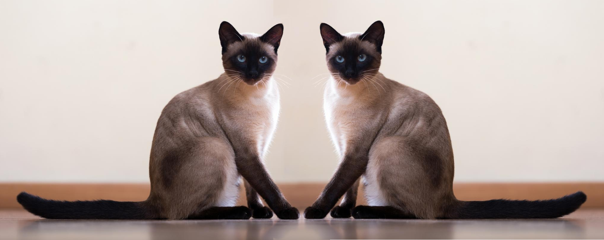

# One-Shot Learning via Siamese Networks with _Keras_


*Siamese twins made with [_GIMP_](https://www.gimp.org/) via mirroring a [Siamese cat](https://mypetandi.bayer.com/sites/g/files/kmftyc426/files/styles/paragraph_image/public/2018-03/siamese_cat_01391.jpg?itok=WETlHEaV).*

This repository contains the implementation of the code for 2015 _ICML_ paper [Siamese Neural Networks for One-shot Image Recognition](https://www.cs.cmu.edu/~rsalakhu/papers/oneshot1.pdf) via _Keras_ 2.3.1 with _TensorFlow_ backend.

This is an update to the fork's origin. I prefer to study on it since, in my opinion, it's been the most straightforward implementation about the paper so far. The accuracy level could be up to 83% with this version caused by the optimizer. I'm planning to work on it when I have the time.

## Setup
### Necessary Python Packages
I use Python 3.5.2 on Linux, necessary packages are listed below along with their versions for reference.
* matplotlib (3.0.3)
* numpy (1.17.2)
* opencv-python (4.1.1.26)
* keras (2.3.1)
* tensorflow (2.0.0)
* scikit-learn (0.21.3)
* jupyter (1.0.0)
* dill (0.3.1.1)

You can just run `pip install -r requirements.txt` to install them all.

### Gathering Data
The Siamese network uses [_omniglot_](https://www.omniglot.com/about.htm#meaning) data for training and evaluation. You can find the paper that introduced the data [here](https://escholarship.org/content/qt4ht821jx/qt4ht821jx.pdf).

1) In order to download the dataset, run the command below in a location which will serve as _{omniglot_location}_ :
```
git clone https://github.com/brendenlake/omniglot.git
```

2) In order to achieve the data model to be trained and tested by the network:
```
python load_data.py --path {omniglot_location} --save {pickles_location}
```
## Generating the Model
After gathering the data, run _OneShot_OneStepAtATime.ipynb_ by following the steps below. 
```
git clone https://github.com/mervess/oneshot-to-siamese-networks.git
cd oneshot-to-siamese-networks
jupyter notebook &
```
**Notes**

Beware that the notebook needs to be updated with the _path_ information.

The two images used in the notebook are from the [paper](https://www.cs.cmu.edu/~rsalakhu/papers/oneshot1.pdf) to visualize and compare the network with theirs.

The uploaded version of the network in the notebook is trained up until 55% accuracy fyi. Change the iteration variable in the training block (_n_iter_) for better results.

## References
1) Koch, Gregory, Richard Zemel, and Ruslan Salakhutdinov. "Siamese neural networks for one-shot image recognition." ICML deep learning workshop. Vol. 2. 2015.
2) Lake, Brenden, et al. "One shot learning of simple visual concepts." Proceedings of the annual meeting of the cognitive science society. Vol. 33. No. 33. 2011.

